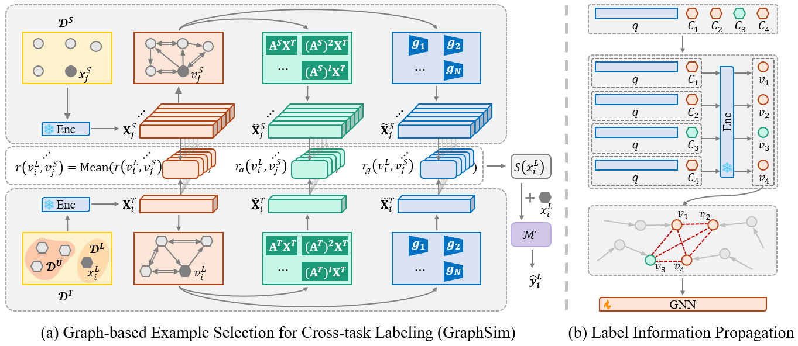

# From Cross-Task Examples to In-Task Prompts: A Graph-Based Pseudo-Labeling Framework for In-context Learning



The capability of in-context learning (ICL) enables large language models (LLMs) to perform novel tasks without parameter updates by conditioning on a few input-output examples. However, collecting high-quality examples for new or challenging tasks can be costly and labor-intensive. In this work, we propose a cost-efficient two-stage pipeline that reduces reliance on LLMs for data labeling. Our approach first leverages readily available cross-task examples to prompt an LLM and pseudo-label a small set of target task instances. We then introduce a graph-based label propagation method that spreads label information to the remaining target examples without additional LLM queries. The resulting fully pseudo-labeled dataset is used to construct in-task demonstrations for ICL. This pipeline combines the flexibility of cross-task supervision with the scalability of LLM-free propagation. Experiments across five tasks demonstrate that our method achieves strong performance while lowering labeling costs.


**Cross-task ICL Setting**: The implementations of EmbSim and GraphSim:

- For **EmbSim** with LLaMA2-7B under one-shot setting:
```
python cross_icl.py -m  "meta-llama/Llama-2-7b-hf" -method "embsim" -k 1 
```
- For **GraphSim** with LLaMA2-7B under one-shot setting:
```
python cross_icl.py -m  "meta-llama/Llama-2-7b-hf" -method "graphsim" -k 1 -s 1122
```

The parameters used in `cross_icl.py` are summarized as follows:

| Parameter | Description                                          |
|-----------|------------------------------------------------------|
| s         | Setting of GNNS in GraphSim (default: 1122)          |
| method    | Method to selected samples (default: embsim)         |
| m         | LLM backbone (default: "meta-llama/Llama-2-7b-hf")   |
| d         | GPU device location (default: 0)                     |
| k         | Number of examples used in ICL (k=shot) (default: 1) |


**In-task ICL Setting**: The implementations of Zero-shot, $\mathcal{L}_{LLM}$, GLIP, Ours and Oracle:

- For **$\mathcal{L}_{LLM}$** with LLaMA2-7B under one-shot setting:
```
python llm_labeling.py -m  "meta-llama/Llama-2-7b-hf" -k 1 
```
- For **GLIP** with LLaMA2-7B under one-shot setting:
```
python glip.py -m  "meta-llama/Llama-2-7b-hf" -k 1 
```
- For **GraphSim+GLIP** (which represents our whole pipeline) with LLaMA2-7B under one-shot setting, modify _data["answer"]_ with the output of **GraphSim** and run:
```
python glip.py -m  "meta-llama/Llama-2-7b-hf" -k 1 
```
- For **Oracle** with LLaMA2-7B under one-shot setting:
```
python gt_labeling.py -m  "meta-llama/Llama-2-7b-hf" -k 1 
```
- As for **Zero-shot**, directly modify _demo = True_ in `gt_labeling.py` as _demo = False_ and run:
```
python gt_labeling.py -m  "meta-llama/Llama-2-7b-hf" 
```
The parameters used in `llm_labeling.py`, `glip.py`, and `gt_labeling.py` are summarized as follows:

| Parameter | Description                                          |
|-----------|------------------------------------------------------|
| m         | LLM backbone (default: "meta-llama/Llama-2-7b-hf")   |
| d         | GPU device location (default: 0)                     |
| k         | Number of examples used in ICL (k=shot) (default: 1) |
